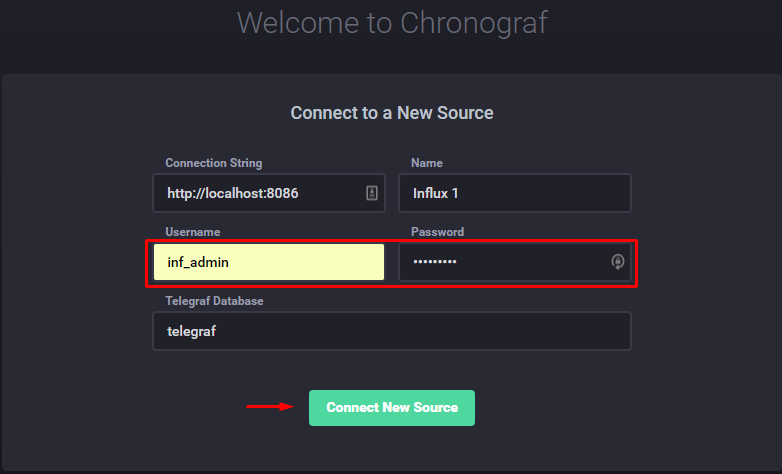
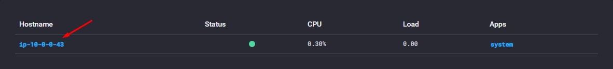
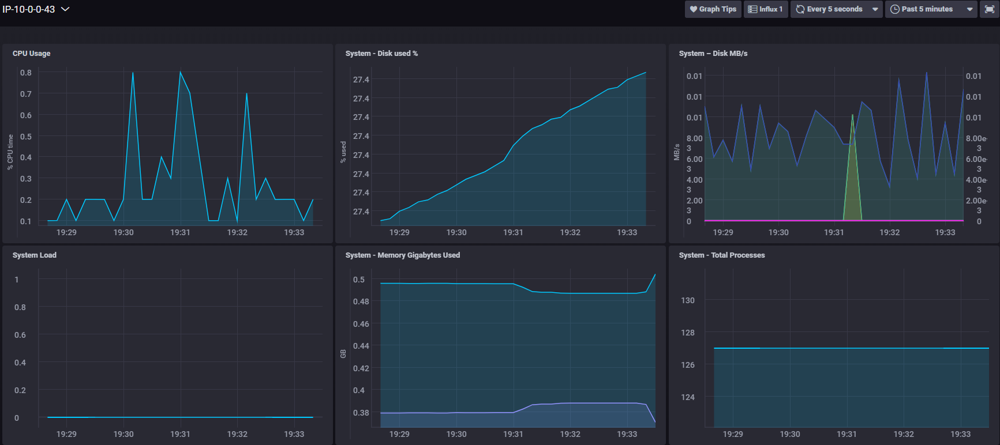

The ***Deploy.sh*** Script deploys the TICK stack components. 
The following projects Telegraf, InfluxDB, Kapacitor, Chronograf will be installed and will be configured together.

### Prerequisites

1. Linux Ubuntu OS
2. **Execute** permission for ***Deploy.sh*** file

### Installing TICK stack

Run ***Deploy.sh*** script on ubuntu machine and follow the messages during the running. 
At the end of the installation you can access the Chronograf UI through the browser.

### Login to Chronograf

Launch your browser and browse to http://localhost:8888 
Insert the following credentials and click on "**Connect New Source**" button: 
Username: **inf_admin** 
Password: **inf_admin** 
  
Click on the hostname link 
 
And you should get the metrics graphs 
 
## Author

* **Oren Cohen**

## References

* https://www.influxdata.com/time-series-platform/
